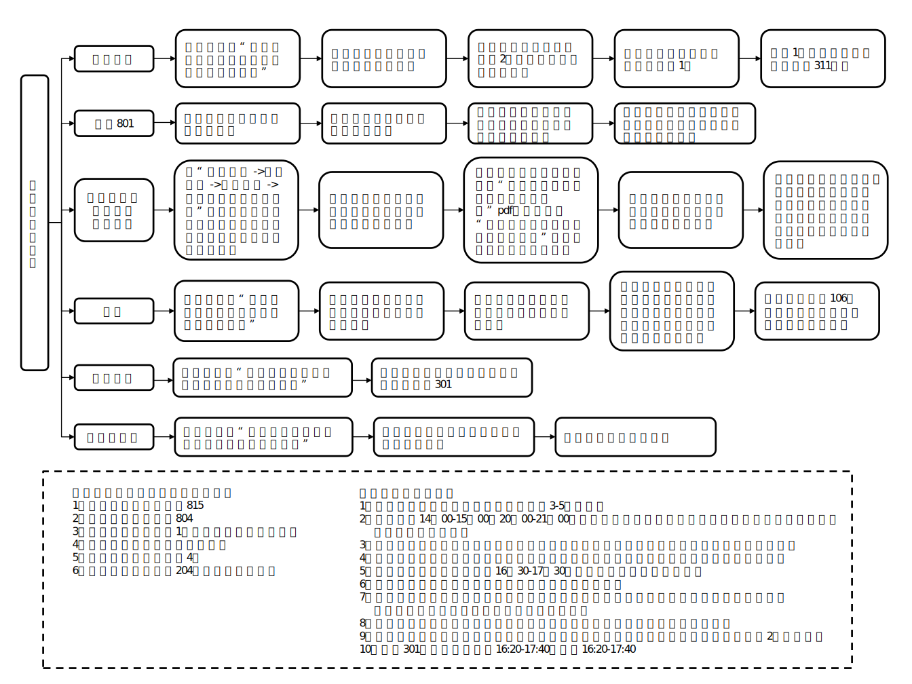

可能每年会有变化，但应该差不多，如果认识人会比较好操作

注意：

* 教室用来打比赛
* 小剧场、多功能厅、中心报告厅用来办一培和院新生赛决赛

## 一、学活场地申请

学活所有场地申请网站：[学活场地申请系统 (xshdzx.bjtu.edu.cn)](http://xshdzx.bjtu.edu.cn/hdzx_v4/)

最多可以申请到当日往后第15天的教室，比如今天是 9.17 周六，那么我可以申请到两周后的 10.02 周日的教室。每天早上7点开放新的一天的教室申请。

### 1.1 学活教室

#### 1.1.1 教室介绍

一共有四个教室 403 440 441 603：

其中 441 和 603 更大一些，440 也还可以，不过 403 就有些小了。

> 441的多媒体需要自带电脑，而且是 VGA 的线，有必要的话记得准备 HDMI 转接头。

#### 1.1.2 申请流程

1. **申请 |** 在网站上申请
2. **申请 |** 在团办工作群请负责教室申请的同学审批  
    截图发群里，并 @ 负责人。
3. **开门 |** 提前一两天用一卡通在学活一楼一岗（就是前台的一号那里，可能上班时间是8 ~ 18，要注意）领取开门条（一张纸条）
4. **开门 |** 当日将开门条交给楼长，四楼电梯口对面的六个房间中的右手第一个房间找楼长。

### 1.2 学活小剧场申请

地点：302

#### 1.2.2 申请流程

过程比较繁琐，需要两头跑很多次，所以最好提前三四天搞，不要到两天内。

1. **申请 |** 在网站上申请
2. **申请 |** 在团办工作群请负责教室申请的同学审批  
    截图发群里，并 @ 负责人。
3. **跑场地准备 |** 从系统上下载 `学生活动服务中心场地申请审批表.pdf` 打印四份  
    例：[【金山文档】 学生活动服务中心场地申请审批表（22一培）](https://kdocs.cn/l/ck53yIXDuymN)
4. **跑场地准备 |** 填写 `活动审批表.docx` 打印四份
    例：[【金山文档】 小剧场审批表（22一培）](https://kdocs.cn/l/ctvqImFO5EAF)
5. **跑场地 |** 拿去逸夫找辅导员盖章
6. **跑场地 |** 拿去学活8层校团委盖章（具体哪个房间看贴的指示或者问老师）
7. **跑场地 |** 拿去机械楼的会议中心审核(机械工程楼北门一楼右手边会议室，新生体检的哪里，进去以后右拐的门)
8. **跑场地 |** 拿去学活4层小剧场中控室（会议中心的老师会给你两套+一张表叫你送给学活琴房那边的416，然而其实416的阿姨或者叔叔会叫你去交给中控室，“两套”全都要交给中控室，“一张”是到时候开门用的）
9. **跑场地 |** 然后拿去一楼保卫室（这个21年22年都不用弄，就不管了）
10. **开门 |** 拿着你留的那张去中控室

**大致流程应该差不多。**

### 1.3 学活多功能厅申请

没有经验，不清楚，应该和学活差不多，一般优先抢小剧场

## 二、普通教室、中心报告厅申请（一般东区或逸夫）

### 2.2 申请流程

1. **找教室 |** 去教务系统找合适的空教室
2. **申请 |** 填写 `多媒体教室（中心报告厅）使用申请审批单.docx`
    注意文件名格式：`申请教室 第几周 周几 第几节.docx`
    [【金山文档】 YF301 302 第七周 周日 第3~5节 ](https://kdocs.cn/l/cmxQ5g0M6eAQ)
3. **申请 |** 在团办工作群请负责教室申请的同学审批  
    把上面的表发到团办工作群，并 @ 负责人
4. **跑场地准备 |** 把表打印两份
5. **跑场地 |** 拿去逸夫找辅导员盖章
6. **跑场地 |** 拿去思西教务处盖章，一份他们收着一份自己拿着（**16:30-17:30**）
7. **跑场地 |** 拿去机械楼 311（**应该也是差不多16:30-17:30**）
    （记得送之前给表拍照留个底，到时候去教室清人的时候可用作证明）

## 三、场地信息填写

> 更多的具体的某个活动的内容填写见对应活动的指南文件

- **社团单位**：
    软件学院
- **负责老师**：
    写辅导员
- **安保措施**：
    突然停电：工作人员组织现场人员撤离，保证秩序。  
    意外火灾：工作人员组织现场人员撤离，并用现场工具进行灭火，如果火情较大，呼叫119。  
    突发地震：工作人员组织现场人员撤离，将人员带到室外空旷处。  
    其他：（1）活动前有针对性地对学生进行安全教育（2）安排必要的管理人员，明确所担负的安全职责（3）制定人员疏散方案及相应的安全应急预案

‍
